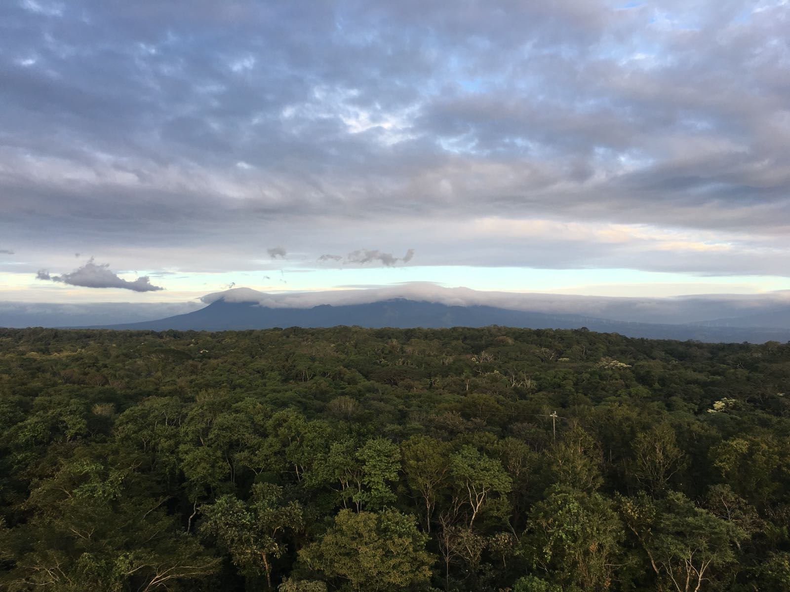

```{r setup, include=FALSE}
knitr::opts_chunk$set(echo = FALSE)

# Learn more about creating websites with Distill at:
# https://rstudio.github.io/distill/website.html

# Learn more about publishing to GitHub Pages at:
# https://rstudio.github.io/distill/publish_website.html#github-pages

library(leaflet)
```

```{r, fig.cap = "Santa Rosa National Park view from the tower"}

```


# Site location

```{r}
sr_map <- leaflet() %>%
  addTiles() %>%  # Add default OpenStreetMap map tiles
  setView(lng = -85.6288, lat = 10.8529, zoom = 10) %>% 
  addMarkers(lng = -85.6288, lat = 10.8529, 
             popup = "Carbon Flux Tower at Santa Rosa National Park")

sr_map
```

